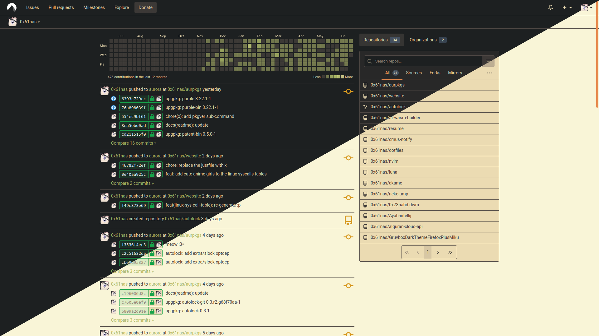

# Forgejo Gruvbox

Customizable Gruvbox color scheme for Forgejo frontend.

[](https://raw.githubusercontent.com/0x61nas/forgejo-gruvbox-styl/aurora/forgejo-gruvbox.user.styl)



## Installation

### Client-side (Stylus)

1. Install the [Stylus](https://chrome.google.com/webstore/detail/stylus/clngdbkpkpeebahjckkjfobafhncgmne) extension for Chrome or [Stylus](https://addons.mozilla.org/firefox/addon/styl-us/) for Firefox.
2. Click the badge above to install directly from GitHub.
3. Done -- updates are automatic.

### Server-side Installation (Forgejo Admin)

The theme can also be applied server-wide by Forgejo administrators using flat CSS files (no Stylus extension needed).

**Option 1 -- Download pre-flattened files**

Grab a `forgejo-gruvbox-*.css` file from the latest release on any of these remotes:

- **GitHub**: https://github.com/0x61nas/forgejo-gruvbox-styl/releases
- **Codeberg**: https://codeberg.org/0x61nas/forgejo-gruvbox-styl/releases
- **Disroot**: https://git.disroot.org/anas/forgejo-gruvbox-styl/releases
- **Codefloe**: https://codefloe.com/anas/forgejo-gruvbox-styl/releases

**Option 2 -- Generate from source**

Run `flatten.sh` to produce a flat CSS for a specific variant:

```
./flatten.sh forgejo-gruvbox.user.styl <variant> forgejo-gruvbox-<variant>.css
```

Available variants: `light-soft`, `light`, `light-hard`, `dark-soft`, `dark`, `dark-hard`.

For example:

```
./flatten.sh forgejo-gruvbox.user.styl dark-hard forgejo-gruvbox-dark-hard.css
```

The resulting CSS can be loaded server-side via Forgejo's custom header or CSS injection (`app.ini` `[ui]` `CUSTOM_HEADER` / `CUSTOM_CSS`), or placed in your instance's `public/assets/` directory.

## Source Code

Contributions are accepted on any of the following remotes:

- **GitHub**: https://github.com/0x61nas/forgejo-gruvbox-styl
- **GitLab**: https://gitlab.com/anelgarhy/forgejo-gruvbox-styl
- **Codeberg**: https://codeberg.org/0x61nas/forgejo-gruvbox-styl
- **Disroot**: https://git.disroot.org/anas/forgejo-gruvbox-styl
- **Codefloe**: https://codefloe.com/anas/forgejo-gruvbox-styl
- **GitGud**: https://gitgud.io/anelgarhy/forgejo-gruvbox-styl
- **Tangled**: https://tangled.org/anas.tngl.sh/forgejo-gruvbox-styl

## License

CC BY-SA 4.0
